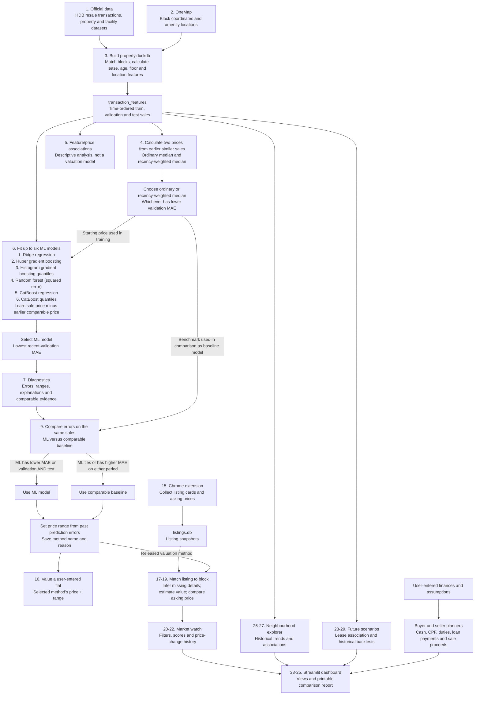

# How the data and calculations flow

This guide follows the numbered workflow from official data to a price estimate, listing analysis, and the dashboard. **Registered HDB resale prices** are the targets used to train and evaluate the valuation models. A listing's **asking price** is collected separately and compared with an estimate later; it is not used as the true sale price for model training.

## End-to-end flow chart



The Control Center's **4. Run modelling pipeline** button runs numbered Steps **04–07, then 09**. These script numbers are different from the button number. **The lines meeting at Step 09 are not a loop.** The comparable price is used once as the ML model's starting price and again as the benchmark for deciding which method to release. Step 09 then follows one of two paths; both end at range calibration.

“ML wins both” means its **mean absolute error (MAE) is lower on both the validation sales and the test sales**, compared with the comparable baseline on those same sales. For example, if ML has lower error on validation but higher error on test, the comparable baseline is selected. A tie also selects the baseline. The selected method and reason are printed and saved in the Step 09 release report.

## Official data and feature calculations: Steps 01–03

Step 01 obtains registered resale transactions, HDB property information, and supporting official datasets. Step 02 obtains or reuses OneMap block coordinates and amenity locations. Step 03 matches transactions to HDB blocks in `data/property.duckdb` and builds `transaction_features`. It calculates, among other fields, storey midpoint, remaining lease, building age at the sale month, distance to the nearest amenity of each type, and counts within 1 km. A block without coordinates keeps its other usable data, while its distance features are unavailable. The database build also exports model-ready Parquet data.

Transactions are divided by month: older sales are **training** data, the following 12 months are **validation** data, and the latest 12 months are **test** data. These are chronological groups, not random samples. See [the database build](../scripts/phase_1_resale_model/03_build_duckdb.py).

## Comparable starting price: Step 04

For a target flat, Step 04 searches **earlier months** for similar completed sales. It first tries similar flats in the same block, then nearby flats of the same model, then wider town groups. Its final fallback uses earlier sales of the same town and flat type. The selection considers flat type and model, floor area, storey and, where coordinates exist, distance. Recent tiers normally use a 24-month window. No target can use its own price or another sale from the same month as evidence.

The script computes three simple price baselines: a recent town/flat-type median, the ordinary median of the selected comparables, and a **recency-weighted** median of those same comparables. In the weighted version, a sale's weight halves for every additional six months of age. The comparable method with lower **validation mean absolute error (MAE)** supplies the starting price for Step 06; test data does not select it. The candidate results are in `reports/phase_1_resale_model/04_baseline_metrics.json`. See [the baseline script](../scripts/phase_1_resale_model/04_build_baselines.py).

## Feature analysis and six model candidates: Steps 05–06

Step 05 reports relationships between features and resale prices. It is descriptive: a relationship with price does not establish that a feature caused the price difference.

Step 06 adds the selected earlier comparable price to the property features. Other features include town, flat type, flat model, size, lease, storey, building characteristics, coordinates, amenity proximity, sale timing, and calculated interactions. Each model learns this target:

```text
training adjustment = registered sale price - earlier comparable price
predicted resale price = earlier comparable price + model-predicted adjustment
```

For example, a comparable price of S$600,000 plus a predicted adjustment of S$20,000 gives a S$620,000 point estimate. Training rows with no earlier comparable price are excluded and counted in the Step 06 report.

| Candidate | Main calculation |
| --- | --- |
| Ridge regression | Regularised, additive feature contributions. |
| Gradient boosting | Sequential trees, where later trees improve earlier predictions. |
| Scikit-learn quantile boosting | Separate lower, middle and upper quantile models; the middle is the point estimate. |
| Random forest | Average of 80 trees using squared-error splits. |
| CatBoost regression | Boosted trees with native category handling and MAE loss. |
| CatBoost quantile | Lower, middle and upper quantile estimates; the middle is the point estimate. |

CatBoost candidates are fitted only when CatBoost is available. The fitted model with the lowest MAE in the **latest half of validation months** is selected; overall validation MAE breaks a tie. The later test period reports performance rather than choosing a model. MAE is the average absolute difference between estimated and registered sale prices, in Singapore dollars. See [the training script](../scripts/phase_1_resale_model/06_train_resale_models.py).

## Diagnostics and release: Steps 07 and 09

Step 07 checks model errors, range coverage, traceability and comparable evidence. It appends an `error_breakdown` after the original sections of `reports/phase_1_resale_model/07_phase1_exit_review.json`. This compares the selected model with the comparable method on the **same test sales**, grouped by town, flat type, lease band, predicted-price band, comparable tier and count, and sale month. Groups with fewer than 30 sales are labelled limited evidence. Ridge can provide additive contributions for an individual estimate; nonlinear models are not given a misleading Ridge-style explanation.

Step 09 checks whether the selected ML model's MAE is **strictly lower** than the selected comparable method's MAE on both validation and test sales. If so, it uses the ML model. Otherwise it **automatically selects the comparable baseline**, prints why the ML model lost, and uses the baseline to value flats and listings. The release records both methods' scores and the selected method. To **calibrate a price range**, Step 09 measures the selected method's past errors on validation sales (`actual sale price − estimated price`). It tries both a symmetric range, using absolute errors, and an asymmetric range, using lower and upper error cutoffs. It checks which approach has coverage closest to the stated level on later validation months, then uses that approach and the full validation error set to place a lower and upper bound around each test estimate. This adjusts the **range**, not the central price estimate. The nominal range widens when fewer than five comparables support an estimate; fewer than three are marked insufficient evidence. The release record is `reports/phase_1_resale_model/09_blend_release.json`. Test results have been inspected during development and now also affect this choice; a later untouched period is needed for independent confirmation. See [diagnostics](../scripts/phase_1_resale_model/07_phase1_diagnostics.py) and [method selection and calibration](../scripts/phase_1_resale_model/09_calibrate_accepted_blend.py).

## Flat valuations, listings and market watch: Steps 10, 15, 17–25

Step 10 takes a user's flat details, finds earlier comparables, uses the released **ML model or comparable baseline**, and returns the selected method, point estimate, calibrated range, comparable count and supporting sales. It does not know a flat's renovation, view, orientation or exact condition. See [single-flat valuation](../scripts/phase_1_resale_model/10_predict_flat.py).

Step 15 collects visible listing cards and **asking prices** with the Chrome extension into a separate `data/listings.db`. Steps 17–19 match a listing to an HDB block, add location features, infer missing flat details or test plausible storey scenarios, then apply the **same released valuation method**. They calculate the difference between asking price and estimated price. Listings without enough usable evidence receive no estimate; their asking price is not treated as a registered sale.

Steps 20–22 filter and score listings by estimated value, user suitability, evidence and freshness; they also compare prices across complete collection snapshots. Steps 23–25 create dashboard views, display them in Streamlit, and generate a printable comparison report on request. See [listing analysis](../scripts/phase_4_market_watch/17_19_build_listing_analysis.py), [market watch](../scripts/phase_4_market_watch/20_22_build_market_watch.py), and [dashboard views](../scripts/phase_5_stakeholder_dashboard/23_build_dashboard_views.py).

## User-input planners and other dashboard pages

The **buyer planner** uses the user's asking price, HDB value or stated assumption, loan and household inputs. It calculates the financing base as the lower of price and value; cash over valuation as the excess of price over value; a planning loan limit; CPF and cash required; tiered Buyer's Stamp Duty; user-entered Additional Buyer's Stamp Duty; other costs; monthly loan payment; and affordability screens. It can compare offers and sensitivity cases. These are planning calculations, not model predictions. See [buyer calculations](../scripts/phase_2_buyer_planner/11_buyer_cost_planner.py).

The **seller planner** starts from the user's sale-price scenarios. It allocates the sale amount to the outstanding loan, then the required CPF refund, then selling costs, leaving estimated cash proceeds. It shows shortfalls and can compare the result with a next-home buyer plan. See [seller calculations](../scripts/phase_3_seller_planner/13_seller_proceeds_planner.py).

Steps 26–27 populate the **neighbourhood explorer** with historical sales, median prices, maps and feature associations. Steps 28–29 calculate an observed lease/price association and historical repeat-sale variation, then combine a chosen starting value with **user-entered** market-growth assumptions to draw future scenarios and ranges. Those scenario lines are conditional calculations, not forecasts made by the resale-price model. See [explorer data](../scripts/phase_6_neighbourhood_explorer/26_build_feature_explorer.py) and [future scenarios](../dashboard/phase_7/29_future_scenario_explorer.py).

## Current model state

Step 04 has evaluated and selected the recency-weighted comparable method on the current data. Its validation MAE was **S$40,828**, versus **S$51,061** for the original comparable median; test MAE was **S$37,903**, versus **S$39,679**. The currently saved CatBoost release was trained **before** this Step 04 change. Run the Control Center's **4. Run modelling pipeline** button to retrain and reevaluate Steps 04–07 and 09 before treating the new starting price as part of the released model. The new Step 07 error breakdown currently describes the earlier saved model until that run completes.
