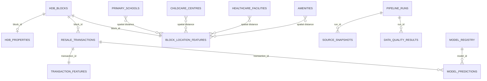

# Singapore HDB Resale Decision Tool — Implementation Plan

## 1. Product goal

Build a transparent HDB resale decision tool that addresses these distinct problems for buyers, sellers, and property agents:

| ID | Problem statement | Who faces it | Planned phase |
|---|---|---|---|
| P1 | People cannot easily judge a reasonable price range for a specific flat from broad town averages or a seller's asking price. | Buyers, sellers, agents | 1 |
| P2 | Recent sales are available, but identifying truly comparable flats and accounting for differences takes time and judgment. | Buyers, sellers, agents | 1 |
| P3 | A price estimate can appear precise even when important unit details or enough comparable sales are missing. | Buyers, sellers, agents | 1 |
| P4 | Buyers may know the asking price but struggle to estimate the upfront cash, CPF use, monthly payments, and other purchase costs. | Buyers | 2 |
| P5 | Sellers may know the likely sale price but not their usable proceeds after the loan, CPF refund, and selling costs. | Sellers | 3 |
| P6 | Buyers spend time checking listings that are unsuitable, duplicated, stale, or priced well outside a defensible range. | Buyers, agents | 4 |
| P7 | Comparing flats across price, lease, commute, schools, and daily amenities is difficult when the information is scattered. | Buyers, agents | 4 and 6 |
| P8 | Agents spend time assembling comparable sales and cost scenarios into clear, consistent advice for each client. | Agents | 5 |
| P9 | People want to know which flat and neighbourhood characteristics are associated with higher or lower resale prices, while avoiding misleading claims of cause and effect. | Buyers, sellers, agents | 6 |
| P10 | Buyers and sellers must make decisions under uncertain future prices and interest rates, with few transparent ways to compare possible outcomes. | Buyers, sellers, agents | 7 |
| P11 | A one-town, one-portal pilot cannot provide dependable national listing coverage or unattended refreshes. | Buyers, sellers, agents, operators | 8 |

For an existing owner, such as someone who bought a Fernvale flat for about S$550,000, the original purchase price is useful for personal gain or loss calculations. Current comparable sales and the owner's outstanding obligations are needed to estimate today's market price and usable sale proceeds.

The first release should focus on HDB resale flats, with Fernvale and Sengkang as the pilot area. It should produce an estimated range with evidence and uncertainty rather than present one number as an official valuation.

## 2. Recommended implementation order

| Order | Project / phase | Main user value | Core deliverable | Difficulty | Why it comes here |
|---:|---|---|---|---|---|
| 1 | Comparable sales and fair-price range | Buyers can assess an asking price; sellers can set one; agents can support recommendations with evidence. | Address search, recent comparable sales, estimated price range, confidence level, and explanation of the main price factors. | Medium | This is the shared data and modelling foundation for every later feature. |
| 2 | Buyer's full-cost planner | Buyers understand affordability beyond the advertised price. | Cash and CPF needs, estimated loan payment, Buyer’s Stamp Duty, legal costs, renovation allowance, and scenario comparison. | Medium | It turns the price estimate into a real household decision. |
| 3 | Seller's proceeds planner | Sellers understand how much they may retain and whether a replacement home is affordable. | Estimated sale proceeds after outstanding loan, CPF refund with accrued interest, selling costs, and optional next-home scenario. | Medium | It adds immediate personal value and reuses the valuation output. |
| 4 | Market watch and deal finder | Buyers and agents can find suitable flats and identify unusually priced listings. | Saved searches, alerts, estimated discount or premium against fair value, and a shortlist ranked by user preferences. | Medium to high | It depends on a lawful, reliable source of current asking-price listings. |
| 5 | Stakeholder dashboard and local comparison report | Stakeholders can explore the pilot results, while agents and household users can turn the same evidence into a consistent, printable explanation. | GitHub-ready local Streamlit dashboard plus an exportable report covering listings, comparables, trends, price ranges, assumptions, and cost scenarios. | Medium | The local Steps 23–25 reuse Phase 4 data. Public deployment and Singapore-wide validation remain later work. |
| 6 | Neighbourhood and feature explorer | Users can understand how location and flat attributes relate to price. | Map and charts for transport, schools, amenities, remaining lease, floor range, size, flat model, and their observed price relationships. | Medium to high | It requires reliable geospatial enrichment and careful explanation of correlation. |
| 7 | Future-price scenario explorer | Users can explore possible outcomes under different market assumptions. | Conservative, baseline, and optimistic scenarios for 1, 3, and 5 years, with assumptions and broad uncertainty bands. | High | Long-term forecasts are much less reliable and should only be added after the present-value model is proven. |
| 8 | National multi-source data operations | Users can compare listings across Singapore from repeatable, monitored source refreshes. | Common listing contract, permitted automated collectors, additional portal adapters, cross-source deduplication, national feature coverage, and town-aware model validation. | High | Expansion should follow a stable local product and must preserve source traceability and failure isolation. |

## 3. Delivery phases

### Phase 0 — Data feasibility and product definition

**Objective:** Confirm that the available data can support a useful and legally sustainable product.

**Work:**

- Define the first users: HDB buyers, HDB sellers, and agents serving them.
- Start with Sengkang and Fernvale, but design the data model to support all HDB towns.
- Use official or licensed data sources. Do not scrape listing portals that prohibit automated collection.
- Build a data dictionary covering transaction, block, location, amenity, and financial fields.
- Measure missing values, inconsistent addresses, duplicates, and time coverage.
- Define a repeatable local pipeline in which Python controls the extraction and modelling workflow, SQL describes data operations, and the embedded DuckDB engine stores trusted analytical tables in a persistent `property.duckdb` file.
- Define what “fair value” means: an estimated market price range based on comparable registered transactions.
- Define success metrics before training a model.

**Current official data-source register:**

| Data table or service | Use in this project | Location method | Source |
|---|---|---|---|
| Resale flat prices based on registration date from Jan 2017 onwards | Transaction history and valuation target | Joined to HDB block coordinates | [HDB — data.gov.sg](https://data.gov.sg/datasets/d_8b84c4ee58e3cfc0ece0d773c8ca6abc/view) |
| HDB Property Information | Building age, floor count, dwelling mix, and block facilities | Block and street geocoded through OneMap | [HDB — data.gov.sg](https://data.gov.sg/datasets/d_17f5382f26140b1fdae0ba2ef6239d2f/view) |
| LTA MRT Station Exit (GEOJSON) | MRT and LRT station proximity | Source coordinates; exits grouped into one station centroid | [LTA — data.gov.sg](https://data.gov.sg/datasets/d_b39d3a0871985372d7e1637193335da5/view) |
| General information of schools | Primary-school proximity; filter to `mainlevel_code = PRIMARY` | Official postal code or address geocoded through OneMap | [MOE — data.gov.sg](https://data.gov.sg/datasets/d_688b934f82c1059ed0a6993d2a829089/view) |
| Listing of Centres | Active childcare-centre proximity; filter to `service_model = CC` | Official postal code or address geocoded through OneMap | [ECDA — data.gov.sg](https://data.gov.sg/datasets/d_696c994c50745b079b3684f0e90ffc53/view) |
| CHAS Clinics (GEOJSON) | Available bulk open-government clinic locations | Source coordinates and addresses | [MOH — data.gov.sg](https://data.gov.sg/datasets/d_548c33ea2d99e29ec63a7cc9edcccedc/view) |
| Official public-healthcare institution list | All 28 public polyclinics | Each official facility name geocoded through OneMap | [MOH/HealthHub](https://support.healthhub.sg/hc/en-us/articles/59231470113689) |
| OneMap Search API | HDB geocoding and discovery searches for malls and supermarkets | Coordinates returned by OneMap | [OneMap Search API](https://www.onemap.gov.sg/apidocs/search) |
| OneMap Themes API | Hospitals, parks, libraries, community clubs, and hawker centres | Coordinates returned by the selected exact theme | [OneMap Themes API](https://www.onemap.gov.sg/apidocs/themes) |

The CHAS layer is the available bulk open-government clinic dataset and does not represent every licensed or specialist healthcare provider. Mall and supermarket search results also require coverage and false-positive checks before modelling. Bus stops, routes, and service frequency are excluded from the current scope.

User-entered listing details remain the temporary source for asking prices until a permitted current-listings feed is available.

**Completion criteria:**

- At least 95% of recent Sengkang transaction addresses can be located and joined to block information.
- Data licences and attribution requirements are recorded.
- The DuckDB tables, join checks, and pipeline run history can be recreated from the retained raw files.
- A baseline evaluation period and error metric are agreed.

### Phase 1 — Comparable sales and fair-price range

**Objective:** Produce a useful, explainable estimate for an HDB resale flat.

**Inputs:**

- Block and street.
- Flat type and floor area.
- Storey range.
- Flat model.
- Lease commencement date or remaining lease.
- Valuation date.
- Optional details that are absent from official transaction data, such as condition or renovation quality, clearly marked as user supplied.

**Approach:**

1. Create a rules-based comparable-sales baseline using recent, nearby transactions with similar flat type, size, lease, and floor range.
2. Train candidate models on older transactions and select among them using validation MAE; retain the comparable-sales and recent town/flat-type median baselines in the same evaluation matrix.
3. Keep a later chronological test split untouched until final model and range evaluation. The current selected Ridge model was chosen on validation; the comparable-sales baseline remains a required challenger because it can be competitive.
4. Break held-out errors down by town, flat type, actual-price band, floor area, storey range, lease band, and transaction year. Mark groups below 30 examples as too small to judge and flag groups with MAE at least 1.25 times overall MAE for review.
5. Calibrate asymmetric global residual ranges using a later validation period. Compare calibration methods using an earlier calibration period and later validation assessment period; use group-specific calibration only if it demonstrates reliable out-of-time coverage. Use a wider nominal interval where fewer than five comparable sales support an estimate, and explicitly flag fewer than three as insufficient evidence.
6. Explain each estimate using the selected Ridge model's additive feature contributions and up to ten ranked earlier comparable transactions. Describe feature contributions as associations, not causes.
7. Recheck estimates for point estimates inside their bounds, traceability to model and source transactions, segment-level failure signals, and held-out interval coverage and width.

**Current Phase 1 checkpoint (29 September 2026):**

The diagnostics are implemented and have been run against the Sengkang pilot. Ridge was selected using validation MAE. On the held-out test, Ridge MAE was S$40,010, compared with S$39,679 for the comparable-sales baseline and S$63,885 for the recent town/flat-type median baseline. Ridge therefore clears the simple-median criterion but does not beat the comparable-sales baseline on this test; keep both results visible and do not describe Ridge as the best-performing method overall.

The global residual interval was chosen because its later-validation assessment coverage (94.71% at nominal 95%) was better than the town/flat-type method (90.93%). On held-out test transactions, mixed nominal coverage averaged 95.54%, observed coverage was 90.88% (4.66 percentage points below nominal), and mean interval width was S$193,739. This meets the current pilot tolerance of a maximum five-point coverage gap, but ranges remain broad and test coverage is below nominal. Of 1,710 test estimates, 370 had fewer than five comparables and receive a wider nominal 97.5% range; none had fewer than three comparables. All test estimates have ordered bounds, model explanations, and linked comparable evidence.

For the selected Ridge model, the reliability breakdown flags the 2-room group (73 sales; MAE S$67,086; 38.36% interval coverage), the lowest price quartile (72 sales; MAE S$66,494; 38.89% coverage), and 2025 transactions (352 sales; MAE S$54,235; average underprediction of S$47,218) for review. These segment checks flag risks rather than certify accuracy. Review these groups before any buyer-facing use. Current data covers Sengkang only, so this is not a Singapore-wide validation.

The automated Phase 1 status is `pilot_exit_with_open_gaps`: the pilot artifacts and checks are complete, but geographic scope, broad intervals, subgroup errors, and calibration independence remain open. In particular, the selected model had previously been chosen using the full validation period, which includes the later-validation calibration window; the test is the final independent check for this run, but a future release evaluation should reserve a truly untouched calibration period after model selection.

The current Step 09 release decision compares the selected ML model with the selected comparable baseline on validation and test sales. It automatically uses ML only if it beats the baseline on both splits; otherwise it selects the comparable baseline and reports the reason. The chosen method receives a calibrated range and is used for Step 10 and listing valuations. Review Step 07 diagnostics before broader use and confirm this choice on later untouched sales; the current test results have already been inspected during development.

**Current Phase 1 refinement (8 October 2026):**

1. **Comparable starting price — implemented.** Step 04 evaluates the original median and a recency-weighted median over the same earlier-sale comparable groups. The weighted method gives a sale half as much weight for each additional six months of age. The lower-validation-MAE method becomes the starting price for the next Step 06 model run; test sales do not select the method. Before the 10 October lease-matching refresh, weighted versus original MAE was S$40,828 versus S$51,061 on validation and S$37,903 versus S$39,679 on test.
2. **Detailed error review — implemented.** Step 07 appends `error_breakdown` below the original summary and limitations in `reports/phase_1_resale_model/07_phase1_exit_review.json`. It compares model and selected comparable errors on the same test sales by town, flat type, remaining lease, predicted price band, comparable tier and count, and transaction month. Groups with fewer than 30 sales are marked as limited evidence. The current breakdown describes the CatBoost model trained from January 2023 and the selected recency-weighted comparable method.
3. **Automatic correction for towns with few sales — not planned.** A low sale count alone does not justify shifting a valuation. Keep the evidence count visible and judge the error and range instead of imposing an arbitrary correction.
4. **Separate models split at a price threshold — deferred.** A hard boundary would make very similar flats receive different predictions near the cutoff. Revisit only if a later error analysis shows a stable benefit and a defensible boundary.

**Training-window safeguard (9 October 2026):** The national CatBoost model was fitted on sales from January 2023 through September 2024 (S$32,512 test MAE versus S$33,467 for the previous full-history fit and S$37,903 for the then-current recency-weighted comparable method). These figures predate the lease-matching refresh below. Older transactions remain in the earlier-sale comparable history. The training-window experiment showed lower overall error across all 12 test months and 22 of 26 towns, while four towns worsened; this retrospective comparison does not prove future superiority. Step 09 counts the actual model-training sales by town and flat type. When that count is below 100, Steps 10 and 17–19 keep the selected point model, flag limited local evidence, and use a wider residual interval calibrated from the same low-data group. No synthetic sales or automatic town-specific model switch is introduced. Jurong East Executive has 80 such sales and triggers the flag.

In that 9 October run, the wider interval used 810 low-data validation sales and had a nominal 97.5% level. It covered 98.47% of the later validation half and 94.92% of 729 test sales; that test result was below nominal and must be shown, not described as a guarantee. The local interval is never narrower than the national wide interval. A missing or too-small calibration cohort blocks Step 09 rather than silently claiming a calibrated local range.

**Next validation:** Collect genuinely later transactions not used in this development cycle. Recheck error and coverage by town and flat type, especially the four towns where the shorter training window lost and sparse groups such as Jurong East Executive. Evaluate the current release against the comparable method and the prior full-history candidate on those later sales before another model promotion. Rebuild Steps 09, 17–19, 20–22 and 23 after source or model refreshes so dashboard estimates carry the current safeguard.

**Lease-matched comparable refresh (10 October 2026):** The 318D Anchorvale Link review exposed a mixed-age comparable group: much newer leases had pulled the starting price above sales of flats with the target's lease age. Step 04 now first seeks earlier sales within three lease-commencement years at each existing geographic and size tier. If that cohort is too small, it uses the existing wider-lease tier and labels the fallback in the evidence. The ordinary and recency-weighted medians still compete by validation MAE. On the same test period, the selected recency-weighted comparable MAE improved from S$37,903 to S$32,213. All six ML models were retrained on the new starting prices; the selected CatBoost quantile model scored S$31,337 test MAE and beat the comparable method on validation and test. Step 09 applies the existing release gate and calibrates its range. The listing dashboard also warns when a point estimate is at least 15% from the scenario comparable price, and when advertisements share a block, area, and asking price; these warnings do not change the price or establish that two ads are the same unit. This is a retrospective improvement, not a guarantee for future sales or for an individual listing. Check results by lease cohort and town on genuinely later sales before treating the revision as broadly reliable.

**Output:**

- Estimated price range and midpoint.
- Confidence rating based on the number and similarity of comparables.
- Five to ten most relevant comparable transactions.
- Adjustments for time, size, floor range, lease, and location.
- Local price trend and price per square metre.
- Model accuracy for similar flats, stated in dollars and percentage terms.

**Important limitation:**

The source data does not include the exact floor, unit orientation, view, internal condition, renovation quality, or seller urgency. The result is a market estimate, not an HDB valuation or professional valuation.

**Completion criteria:**

- Compare both the selected model and comparable-sales baseline against a simple town/flat-type median baseline on later unseen transactions; report all results and never hide a stronger baseline.
- Report error and bias separately by town, flat type, actual-price band, floor-area band, storey range, lease band, and transaction year. Treat groups with fewer than 30 examples as inconclusive and flag material high-error groups for review.
- Check nominal versus observed prediction-range coverage and mean width on validation and a final untouched test period. Pilot tolerance: absolute coverage gap no greater than five percentage points, with the gap and width still disclosed; a pass does not mean every subgroup is calibrated.
- Every estimate can be traced to source transactions, model version, model explanation, and comparable evidence; bounds must contain the point estimate.
- Estimates supported by fewer than five comparables receive a wider interval; fewer than three must be labelled insufficient evidence.
- Before broad release, validate across multiple towns and reserve calibration data after model selection so it is independent of candidate selection. A pilot pass is not a national release approval.

**Current diagnostic outputs:** `scripts/phase_1_resale_model/07_phase1_diagnostics.py` and `scripts/phase_1_resale_model/07_run_phase1_diagnostics.ps1`; reports `07_reliability_breakdown.csv`, `07_calibrated_price_ranges.csv`, `07_estimate_explanations.csv`, `07_comparable_evidence.csv`, `07_calibration_method_check.csv`, and `07_phase1_exit_review.json`; DuckDB tables `phase1_reliability_breakdown`, `phase1_calibrated_price_ranges`, `phase1_estimate_explanations`, `phase1_comparable_evidence`, `phase1_calibration_method_check`, and `phase1_exit_review`.

### Phase 2 — Buyer's full-cost planner

**Objective:** Convert a property's estimated value and asking price into an affordability decision.

**Work:**

- Accept household budget, available cash and CPF, income, loan type, interest rate, term, and renovation allowance.
- Calculate purchase cash flow and estimated monthly repayment.
- Include Buyer’s Stamp Duty and configurable legal, valuation, insurance, and moving costs.
- Compare asking price, estimated fair-value range, and proposed offer.
- Show sensitivity to interest rates, loan term, purchase price, and renovation cost.

**Output:**

- Upfront cash and CPF estimate.
- Monthly housing payment estimate.
- Total initial cost and optional five-year holding-cost view.
- Affordable-price range based on the user's constraints.
- Side-by-side comparison of shortlisted flats.

**Completion criteria:**

- All formulas cite their source and effective date.
- Users can override assumptions.
- Results distinguish estimates from official eligibility or loan approval.

**Phase 2 local checkpoint (29 September 2026):** Step 11 now takes an editable JSON purchase scenario and returns upfront cash/CPF needs, BSD, user entered ABSD, monthly mortgage and housing outflow, five-year gross outflow, offer and other price comparisons, interest/term/renovation sensitivity, fair-range position, and an indicative affordability ceiling. It is a local calculator, not a web interface. The source and rule review is saved in `data/reference/11_policy_notes.md`, with synthetic inputs in `data/reference/11_buyer_inputs.example.json`. Run `scripts/phase_2_buyer_planner/11_run_buyer_planner.ps1`; the calculator is `scripts/phase_2_buyer_planner/11_buyer_cost_planner.py` and focused tests are in `scripts/phase_2_buyer_planner/11_test_buyer_cost_planner.py`. Personal `reports/phase_2_buyer_planner/11_*.json` inputs and results are excluded from Git. All policy-sensitive values are user editable except the dated BSD marginal schedule; review its source before using the tool after a policy change. The current planner deliberately does not determine HFE eligibility, CPF grants or limits, ABSD remission, or a bank's approval. Real household validation remains to be done.

**Step 12 local form (29 September 2026):** `scripts/phase_2_buyer_planner/12_run_buyer_web_form.ps1` starts a browser page at `http://127.0.0.1:8788/`. Its `web/12_buyer_form.html`, `.css`, and `.js` collect plain-language inputs, call `scripts/phase_2_buyer_planner/12_buyer_web_form.py` on localhost, and pass the resulting values to the same step 11 calculation function. A saved step 10 estimate can fill the fair-price bounds without treating them as HDB's official value. The form does not require or automatically write JSON; downloading the result is optional. The server is bound to `127.0.0.1`, keeps financial inputs out of request logs, and has no external account integration. Step 11's policy notes remain the rule reference. The form also offers an optional document comparison after calculation: users select the matching price scenario, enter independently checked HDB, lender, CPF, stamp duty, or completion figures, and see differences from the plan. This comparison stays in the browser unless the user downloads the JSON. It does not verify the documents or recompute the purchase plan.

**Phase 2 closeout (29 September 2026):** The local MVP is complete. Its formulas are source-linked, material assumptions are editable, and the output distinguishes estimates from HDB/lender decisions. User-requested testing against a real purchase has been deferred, not passed; the document comparison feature is ready when real figures are available. It does not verify documents or eligibility. The planned side-by-side comparison of different flats is not part of this local MVP: current comparisons change the price of one flat. That product extension remains future work.

Official policy references used by step 11: [IRAS BSD](https://www.iras.gov.sg/taxes/stamp-duty/for-property/buying-or-acquiring-property/buyer%27s-stamp-duty-%28bsd%29) (residential marginal rates effective 15 February 2023), [IRAS ABSD](https://www.iras.gov.sg/taxes/stamp-duty/for-property/buying-or-acquiring-property/additional-buyer%27s-stamp-duty-%28absd%29) (buyer-dependent rates from 27 April 2023), [HDB resale financing](https://www.hdb.gov.sg/sitecore/content/hdbinfoweb/home/buying-a-flat/resale-flats/process-for-buying-a-resale-flat/resale-flat-planning/mode-of-financing), [HDB Request for Value](https://www.hdb.gov.sg/buying-a-flat/resale-flats/process-for-buying-a-resale-flat/option-to-purchase/request-for-value), [CPF housing usage calculator](https://www.cpf.gov.sg/member/tools-and-services/calculators/cpf-housing-usage), [MoneySense affordability guidance](https://www.moneysense.gov.sg/buying-a-property-how-much-can-you-afford/), and [HDB loan interest](https://www.hdb.gov.sg/sitecore/content/hdbinfoweb/home/managing-my-home/finances/loan-matters/interest-rate). All pages checked 29 September 2026; the dated rule notes give the exact implemented treatment and exclusions.

### Phase 3 — Seller's proceeds planner

**Objective:** Estimate the usable proceeds from selling a flat and the effect on the next housing decision.

**Work:**

- Accept expected sale price, outstanding loan, CPF principal used, accrued interest, and selling expenses.
- Estimate cash proceeds after repayment and CPF refund.
- Compare proceeds across conservative, midpoint, and optimistic sale-price scenarios.
- Add an optional sell-and-buy view using the buyer planner.

**Output:**

- Estimated cash proceeds.
- Estimated CPF refund.
- Deductions and costs shown individually.
- Sensitivity table across possible sale prices.
- Funds available for the next property under each scenario.

**Completion criteria:**

- Calculation labels make clear which values come from the user, official statements, or assumptions.
- The tool prompts users to verify loan and CPF figures with their official accounts.
- Scenario totals reconcile to their component amounts.

**Phase 3 local implementation (29 September 2026):** Step 13 is `scripts/phase_3_seller_planner/13_seller_proceeds_planner.py`, run with `scripts/phase_3_seller_planner/13_run_seller_planner.ps1`; step 14 is the seller page at `/seller` on the same localhost server started by step 12. The page files are `web/14_seller_form.html`, `.css` and `.js`. The calculator uses user-supplied figures and writes a report only when an output path is supplied; the page saves nothing until the user downloads JSON. `data/reference/13_seller_policy_notes.md` documents official sources and limitations; `13_seller_inputs.example.json` contains synthetic figures. Tests are `scripts/phase_3_seller_planner/13_test_seller_proceeds_planner.py` and `scripts/phase_3_seller_planner/14_test_seller_web_form.py`.

| Phase 3 input | Source or assumption | Use |
|---|---|---|
| Expected sale price; optional conservative and optimistic prices | Seller estimate or Step 10 valuation evidence; missing low/high use illustrative ±5% | Three separate sale scenarios; not model predictions unless independently supplied |
| Outstanding loan at completion | MyHDB financial information or lender redemption statement | First amount settled from sale price; uncovered balance shown as cash top-up risk |
| CPF refund required for all owners | CPF Home ownership dashboard preferred; alternatively principal used + accrued interest + other required refund | Amount returned to CPF from remaining proceeds; shortfall shown separately |
| Agent, legal, resale levy, upgrading and other costs | Seller quote or HDB confirmation; enter only charges that apply | Itemised deductions; any amount not covered by proceeds shown as cash need |
| Optional next-home cash and CPF needs | Step 12 buyer plan or user entry | Compares sale cash and CPF refund separately with next-home needs, without claiming those CPF funds are usable |

For each scenario, sale price is allocated to housing-loan repayment, CPF refund, selling costs and then cash proceeds. The reported parts reconcile to sale price. If price cannot cover the loan, the uncovered loan amount is shown separately; if proceeds after loan cannot cover the CPF refund, the tool shows a CPF shortfall rather than silently making sale cash negative. CPF's no-cash-top-up treatment is conditional on a market-value sale; the tool does not decide that condition. The optional buyer comparison excludes other savings, CPF restrictions, crediting time and second HDB loan requirements. Amounts are planning figures, not profit or a final settlement statement.

**Phase 3 status:** Local calculator and web flow are implemented and pass focused normal, shortfall, reconciliation, and HTTP tests. The completion criteria for source labels, official-account prompts and scenario reconciliation are met for the local MVP. Validation against a seller's actual loan, CPF and HDB completion statements remains open; no personal figures are stored in the repository. If real documents reveal a mismatch, correct the rule or input guidance before expanding to other sellers.

### Phase 4 — Market watch and deal finder

**Objective:** Match current opportunities to user preferences and highlight prices that deserve investigation.

**Dependency:**

Obtain a permitted current-listing source through an official feed, commercial agreement, participating agents, seller submissions, or user-provided listing links/details. Do not build this phase around prohibited scraping.

**Work:**

- Let users save filters for budget, town, flat type, size, lease, transport, schools, and other preferences.
- Score each listing on price, suitability, confidence, and data freshness.
- Show estimated premium or discount against the phase 1 price range.
- Track price changes and listing age when the source permits it.
- Alert only when a new or materially changed listing matches the saved criteria.

**Completion criteria:**

- Source terms allow storage, analysis, and user display.
- Duplicate listings are detected.
- Stale listings and stale estimates are clearly marked.
- A “good deal” label always includes supporting comparables and uncertainty.

**Property listing collection (step 15):** The Chrome extension in the user's regular browser is the sole listing collection route. PropertyGuru Sengkang HDB is the first site adapter; future sites add their own selectors and source parser without changing the collector flow or table. The extension reads page count from page 1, waits a random 3–4 seconds between pages, opens the next numbered results URL in the same tab, and sends cards to a local receiver on `127.0.0.1:8771`. Its scheduled next page survives a tab reload; the popup reports when the receiver is offline. The receiver writes `data/listings.db` (DuckDB), with one `listings` table and `source_site` on every row. Its unique key is `(source_site, run_id, listing_id)`, merging duplicate cards within a run and preserving separate snapshots. Raw card JSON and parsed common fields are kept in that table. No new listing CSV, per-page JSON, or manifest file is written. The database is separate from the replaceable resale-model `property.duckdb`. The Chrome launcher starts the local receiver if needed. Local tests verify multi-source storage, deduplication, run history, and origin rejection; extension adapter, recovery, and JavaScript syntax checks pass. The first live run covered 38 pages and 753 distinct listings, with a one-listing difference from the displayed count. The extension folder keeps its historical `17_propertyguru_chrome_extension` name because Chrome is installed against that path.

**Legacy data import (step 16):** `scripts/phase_4_market_watch/16_import_legacy_propertyguru.py` was used once to import the completed 38-page JSON run from the older receiver into `data/listings.db`. It is a recovery utility, not a recurring collection step. The old step 15–16 scraper prototypes were removed when the Chrome extension became the collection method; the active scripts are now numbered 15 and 16.

**Listing analysis (steps 17–19):** `scripts/phase_4_market_watch/17_19_build_listing_analysis.py` is the repeatable build for the latest complete listing run. Step 17 creates `listing_block_matches` using normalized block and street text, with a unique-block-number fallback and explicit confidence fields. Step 18 creates `listing_features` by joining HDB block/property/location features and inferring flat type from the listing's floor area. Step 19 creates `listing_valuations` with the approved Phase 1 model and its comparable-sales starting price. Because listing cards lack dependable flat-model, lease-year and exact-storey fields, Step 19 evaluates historically observed storey scenarios and records its assumptions, range, supporting comparable count and confidence. Unsupported rows remain `not_valued`.

**Eight-town refresh (10 October 2026):** The latest complete run has 4,874 listings from Ang Mo Kio, Bishan, Hougang, Punggol, Sengkang, Serangoon, Tampines and Yishun. Steps 17–19 produced 4,711 block matches, 4,383 estimates and 491 withheld estimates. The build now indexes transaction history by block, town and block/flat type once, caches repeated block scenarios, and evaluates identical valuation inputs once for advertisements sharing them. The full listing-analysis run completed successfully in about 30 seconds on the local machine. Step 20–22 rankings, Step 23 dashboard views, Step 26 explorer data and Step 28 scenario evidence were rebuilt afterward. The dashboard database is about 71 MiB; monitor its size before future Git pushes because GitHub warns above 50 MiB and blocks ordinary Git files above 100 MiB. This observed runtime is a single local run, not a benchmark against the previous implementation on the same 4,874 listings.

The completed 2 October 2026 build used the 753-row PropertyGuru Sengkang snapshot and `PILOT_RIDGE_COMPARABLE_BLEND_V1`. It produced 752 block matches, 733 estimates and 20 withheld estimates: 14 had no same-block history for the inferred flat type and six lacked a usable block or flat type. Integrity checks found zero duplicate derived keys and zero invalid price-range orderings. One listing (`500271666`) remains unmatched because its result card has no specific block. The summary is stored at `reports/phase_4_market_watch/19_listing_analysis_summary.json`.

**Saved search, history and report (steps 20–22):** `scripts/phase_4_market_watch/20_22_build_market_watch.py` completes the remaining Phase 4 work. Step 20 stores the active profile in `market_watch_preferences` and writes a transparent ranking into `market_watch_rankings`. Value contributes 50% of the score, suitability 25%, supporting comparable evidence 15%, and freshness 10%. A listing can only be labelled `investigate` when it is fresh, meets the profile, has a supported estimate with enough comparables, and is priced at or below its research point estimate. The ranking keeps the estimated range, comparable count and notes alongside the label.

Step 21 derives `listing_snapshot_history` and `listing_snapshot_runs` from the preserved raw `listings` snapshots. It identifies new listings, price reductions, price increases, unchanged listings and listings that disappeared since the immediately earlier complete run. A first collection cannot show price changes: all 753 records are correctly labelled `new`. Step 22 creates `reports/phase_4_market_watch/22_market_watch.html` for normal browser viewing and `22_market_watch_summary.json` as the run receipt. The initial broad Sengkang profile returned 275 investigate candidates, 458 watch candidates and 20 unranked listings. The number is a research shortlist, not a count of confirmed good deals. Personal budget, size and flat-type filters can be supplied through `data/reference/20_market_watch_preferences.example.json`.

**Phase 4 status:** Implementation is complete for the local Sengkang MVP: collection, analysis, rankings, history tables, and the generated market-watch HTML are repeatable in one DuckDB file. Pilot validation is still open. Complete a second full extension collection to verify actual price and availability changes; review the ranking thresholds and explanations with users; test a personal preference profile; and confirm listing-display and redistribution terms before stakeholder publication. Singapore-wide rollout also remains future work and requires removing Sengkang-specific processing filters. A local preference form and alerts are optional extensions; alerts should only be added after a user chooses a profile and delivery channel. These open items do not require rebuilding the Phase 4 data model.

### Phase 5 — Stakeholder dashboard and agent comparison report

**Status:** Local Steps 23–25 are implemented. The current listing snapshot covers eight towns and three collection runs; the hosted dashboard uses the versioned database committed to GitHub. Singapore-wide listing coverage remains open.

**Objective:** Present market-watch and valuation results to non-technical stakeholders through a clear interactive dashboard, and package the same evidence into a client-ready comparison report. Keep the analytical pipeline reproducible in GitHub and capable of expanding from the Sengkang pilot to all Singapore HDB towns.

**Recommended presentation:** Build a read-only Streamlit dashboard because the project already uses Python and DuckDB. Keep the dashboard separate from collection and modelling: it reads stable presentation views and never modifies raw listings, model outputs, or transaction data. GitHub stores and versions the source code; a free Streamlit Community Cloud deployment can provide a shareable pilot URL. GitHub Pages may host a fixed HTML snapshot, but it cannot run the Python application or live DuckDB queries.

#### Implemented workflow: steps 23–25

| Step | Files | Result |
|---:|---|---|
| 23 | `scripts/phase_5_stakeholder_dashboard/23_build_dashboard_views.py` and its test | Builds seven stable views in the existing `data/listings.db`, plus two small helper tables for category rules and copied model metrics. It writes `reports/phase_5_stakeholder_dashboard/23_dashboard_views_summary.json`. |
| 24 | `dashboard/phase_5/24_streamlit_app.py`, `24_run_dashboard.ps1`, and its smoke test | Runs a read-only local dashboard with overview, opportunity, listing detail, changes, quality, and report pages. |
| 25 | `dashboard/phase_5/25_agent_report.py` and its test | Creates a self-contained printable HTML comparison in memory for one to four listings, with optional locally uploaded buyer/seller planning output. |

The local presentation layer currently exposes 4,874 current listings, 58,405 comparable-sale rows, seven data-quality results, and 18 model-evaluation rows. It assigns 45 `investigate_low_price`, 2,265 `below_estimate`, 1,834 `fairly_priced`, 154 `negotiation_candidate`, 85 `likely_expensive`, and 491 `insufficient_evidence` labels. These counts reflect the current saved snapshot and change when the source data and upstream analysis are rebuilt. An eligible listing with adequate evidence is marked `investigate_low_price` when its asking price is below the lower end of its research range. This is a reason to check the unit and listing details, not evidence of an incident or defect.

**DuckDB mental model:** A table stores physical rows in the `.db` file. A view stores a named SQL query and calculates its result from the latest underlying tables when read. Dashboard views therefore behave like tables to Streamlit, Tableau, Power BI, or DBeaver while avoiding another copied listing dataset. `dashboard_category_rules` is a table because it records configuration values. `dashboard_model_metrics` is a small table because those metrics originate in the separate `property.duckdb` file and the dashboard should need only one database at runtime.

**Local application flow:** The user first rebuilds Step 23 while DBeaver is disconnected. Step 24 starts Streamlit on `127.0.0.1:8501`. Streamlit opens `listings.db` read-only, queries the views after each applied filter selection, and renders the returned rows as browser controls, tables, charts, and maps. Step 25 creates the report only when requested; it does not silently save report inputs or outputs. This design supports the product goal of a local tool that ordinary users operate in a browser without learning SQL or installing a database server.

**Online flow:** The same app can later run from GitHub through Streamlit Community Cloud. Its database path is configurable with `PROPERTY_DASHBOARD_DB`. GitHub contains code and safe examples, while working databases, raw listings, personal plans, and credentials remain excluded. Before online publication, provide an approved small demonstration database or a private hosted data source, confirm redistribution rights, and decide how data refresh and access control work. Streamlit Community Cloud can keep the pilot hosting cost at zero within its current limits; more persistent, private, or automated infrastructure may have a cost.

**Stakeholder pages:**

1. Executive overview: active listings, valuation coverage, category counts, new listings, price reductions, refresh date, and a prominent pilot-coverage label.
2. Opportunity finder: a sortable, filterable table for town, flat type, price, size, amenity distance, listing age, confidence, and opportunity category.
3. Listing detail: asking price, estimated range, premium or discount, closest comparables, nearby amenities, price history, assumptions, missing information, and original listing link.
4. Market changes: new, reduced, increased, unchanged, and disappeared listings by snapshot, town, and flat type.
5. Data quality and methodology: address-match coverage, valuation coverage, missing fields, data dates, model version, accuracy metrics, and known limitations.

Use neutral stakeholder-facing categories: `investigate_low_price`, `below_estimate`, `fairly_priced`, `negotiation_candidate`, `likely_expensive`, `insufficient_evidence`, and `does_not_match`. Category rules are recorded with the run and explained beside every listing. Every listing still shows the full estimated range, comparable count, confidence, and inferred fields; no category implies a guaranteed bargain.

**Curated dashboard data layer:**

| View | Grain and use |
|---|---|
| `dashboard_market_overview` | One summary row per snapshot, town, and flat type for executive metrics. |
| `dashboard_current_listings` | One current listing per source and listing ID for the main filterable table. |
| `dashboard_listing_details` | One enriched current listing with valuation, features, assumptions, and quality flags. |
| `dashboard_listing_changes` | One listing observation per snapshot for price and availability history. |
| `dashboard_comparables` | One supporting comparable transaction per listing and scenario. |
| `dashboard_data_quality` | One validation or coverage result per run and check. |
| `dashboard_model_performance` | One model/version/evaluation-segment result for MAE, RMSE, MAPE, R², and interval coverage. |

The dashboard queries only these stable views. This keeps presentation logic independent from internal raw, feature, model, and ranking tables and allows Streamlit, Power BI, or another approved presentation tool to reuse the same definitions.

**GitHub and deployment boundary:**

| Include in GitHub | Exclude from GitHub |
|---|---|
| Dashboard and pipeline source code, tests, view definitions, dependency lock or requirements file, documentation, data dictionaries, example preferences, and a small approved demonstration dataset | OneMap tokens, environment/secrets files, personal buyer or seller inputs, raw listing snapshots, working DuckDB files, caches, logs, and restricted or unnecessarily large generated outputs |

The pilot can use GitHub Free plus Streamlit Community Cloud without a hosting charge, subject to their current resource, privacy, and availability limits. A public static report can use GitHub Pages. Costs may arise later for a continuously available private application, a central database, automatic scheduled refresh, greater storage or compute, more stakeholder access control, or a custom domain. Do not purchase or provision those services until the free pilot demonstrates value and its data-distribution permissions are confirmed.

**Singapore-wide scaling requirements:**

- Remove Sengkang-specific filters from Steps 17–22 and accept one town, several towns, or all towns as parameters.
- Retain shared `source_site`, `run_id`, `listing_id`, `block_id`, and `town` keys; do not create a separate database or script set for every town.
- Partition or aggregate dashboard queries by snapshot date and town so national coverage does not require loading every raw row into the interface.
- Keep collection adapters source-specific while keeping matching, valuation, ranking, history, and dashboard contracts source-neutral.
- Move live dashboard data from a local DuckDB file to managed object storage or PostgreSQL only when concurrent use and automated cloud refresh require it; keep DuckDB for reproducible local analysis and tests.
- Confirm that each listing source permits public redistribution before placing any listing-level demonstration data in a public repository or application.

**Completion criteria:**

- A stakeholder can move from national or town-level summary to a single listing and understand why it received its category.
- Every displayed figure comes from a documented dashboard view and shows its data date and scope.
- Filters work consistently for Sengkang and at least one additional town before national rollout.
- The application starts from a clean repository using documented commands and a safe demonstration dataset.
- Automated tests cover dashboard queries, category rules, empty results, missing estimates, stale snapshots, and town filters.
- No credentials, personal inputs, working databases, or unapproved listing data are committed to GitHub.
- The pilot deployment remains free unless the user explicitly approves a paid hosting, storage, database, domain, or access-control service.

**Current exit review:** The local app starts successfully in Streamlit's test runner; Step 23 integrity tests confirm the views, keys, counts, and positive-category evidence rules; and Step 25 tests confirm report escaping, the four-listing limit, and planning-file validation. A second complete listing snapshot is still needed to validate real price-change presentation. At least one more town and a permitted online demonstration dataset are still required before national or public release.

#### Comparison report

**Report sections:**

- Subject flat and supplied assumptions.
- Estimated price range and confidence.
- Comparable transactions and adjustment notes.
- Neighbourhood trend.
- Buyer costs or seller proceeds when an optional planning result is attached.
- Risks, missing information, and suggested questions for a viewing.
- Data sources, generation date, and model version.

**Completion criteria:**

- Reports reproduce the figures shown in the application.
- Users can edit comparison notes without changing the underlying evidence.
- The report avoids describing the estimate as an official valuation.

### Phase 6 — Neighbourhood and feature explorer

**Status:** Steps 26–27 implemented and tested for the Sengkang transaction dataset. National coverage and model-specific contribution explanations remain future work.

**Objective:** Show how flat and neighbourhood attributes are associated with transaction prices.

#### Implemented workflow: steps 26–27

| Step | Files | Result |
|---:|---|---|
| 26 | `scripts/phase_6_neighbourhood_explorer/26_build_feature_explorer.py`, its PowerShell launcher, and its integrity test | Adds a focused historical-transaction table, a training-only association table, build metadata, and four stable dashboard views to the existing `data/listings.db`. |
| 27 | `dashboard/phase_6/27_feature_explorer.py` and its Streamlit test | Adds **Neighbourhood and features** to the existing local dashboard with flat-type/year filters, summary metrics, monthly price trend, price distribution, block map, selected feature relationship, and matching transaction table. |

The 2 October 2026 build contains 19,513 Sengkang transactions from January 2017 through September 2026, covering 618 transaction-bearing blocks and five flat types. It displays 42 usable feature relationships calculated from the 15,766-row training split; validation and test prices remain excluded from feature screening. The machine-readable build receipt is `reports/phase_6_neighbourhood_explorer/26_feature_explorer_summary.json`.

Step 26 uses physical snapshot tables because the source transaction features live in the separate replaceable `property.duckdb`, while the local application should open only `listings.db`. Step 27 reads stable views and never writes to either database. Rebuild Step 26 after rebuilding Phase 1 data or Step 05 associations.

The first explorer release provides group-level market relationships rather than claiming a model contribution for an individual listing. A true listing-level contribution must be calculated from the exact approved model, its comparable-sales starting price, and the feature values. Adding such a decomposition without preserving those components would be misleading, so it remains a later Phase 6 task.

**Candidate features:**

- Walking distance and estimated travel time to MRT/LRT.
- Distance to primary schools, childcare, hawker centres, supermarkets, parks, clinics, and town centres.
- Floor area, flat type, flat model, floor range, remaining lease, and building age.
- Transaction month, local transaction volume, and recent local price trend.
- Block-level facilities available in official HDB data.

**Output:**

- Map of transactions and amenities.
- Price distributions after filtering for comparable flats.
- Feature contribution for an individual estimate.
- Market-level feature relationships with uncertainty.

**Interpretation rule:**

Describe model findings as associations, not proof that a feature causes a price increase. Correlated location attributes and buyer selection can otherwise produce misleading claims.

**Completion criteria:**

- Geospatial features are calculated consistently and cached with source dates.
- Feature explanations remain stable enough to be useful across model retraining.
- Users can see the comparison group behind every chart.

### Phase 7 — Future-price scenario explorer

**Objective:** Explore possible future outcomes without presenting speculative forecasts as reliable predictions.

**Approach:**

- Build scenarios from explicit assumptions such as overall market growth, lease decay, interest rates, and holding period. Expected supply pressure is part of the overall market assumption until dependable forward supply data exists.
- Back-test the method across older periods before releasing it.
- Prefer broad ranges and scenario comparisons over a single predicted future price.
- Separate market-wide assumptions from flat-specific adjustments.

**Output:**

- Conservative, baseline, and optimistic price paths.
- One-, three-, and five-year ranges.
- Assumptions and sensitivity controls.
- Historical back-test performance and a prominent uncertainty explanation.

**Completion criteria:**

- Scenario assumptions are visible and editable.
- Back-test errors are published beside forecasts.
- The interface never implies guaranteed appreciation or investment returns.

**Implemented workflow (steps 28–29):**

| Step | Files | Purpose |
| --- | --- | --- |
| 28 | `scripts/phase_7_future_scenarios/28_build_future_scenario_evidence.py`, its PowerShell launcher and integrity test | Adds lease-association evidence and dated one-, three-, and five-year matched-sale backtests to the existing `data/listings.db`. |
| 29 | `dashboard/phase_7/29_future_scenario_explorer.py` and its Streamlit test | Adds **Future-price scenarios** to the existing dashboard with editable assumptions, central paths, empirical ranges, financing sensitivity and published backtest errors. |

The price path keeps three components visible. The user supplies an annual market growth or decline for each scenario; this combined assumption may reflect expected demand, supply, policy and economic conditions. A separate supply percentage was deliberately removed because the pilot does not contain a verified forward pipeline of BTO completions, homes reaching MOP, active resale stock and segment demand, and a second manual percentage could double count the market assumption. The lease component is the historical log-price association with one fewer remaining lease year, estimated on training transactions while controlling for sale quarter, flat type/model, floor area, storey, coordinates and selected amenity distances. A direction and magnitude sanity gate prevents an implausible coefficient from reaching the dashboard. A flat-specific adjustment changes the starting value once and should be used only when a verified omitted feature is supported by matched registered sales.

For scenario `s` and future year `t`, the central value is:

```text
adjusted starting value
× (1 + market growth_s)^t
× (1 + observed annual lease effect)^t
```

Interest rate is not used to move the property price. It is applied separately to the entered loan amount and term to show indicative monthly repayment and scheduled interest. Each conservative, baseline and optimistic line is a conditional centre under one assumption set. Its range then applies empirical residual quantiles from closely matched repeat sales. Both are needed: scenarios represent different beliefs about the market, while the range shows historical variation even when one belief is fixed.

Step 28 matches an earlier and later sale in the same block, flat type and model, within 5 sqm and three storeys, and near the requested horizon. Pairs ending before 1 January 2024 calibrate the historical centre and 10th-to-90th-percentile residual range; later pairs provide the backtest. The dashboard publishes MAE, MAPE, range coverage and average range width. The lease coefficient remains observational and is not an official HDB depreciation schedule or proof of causation.

Evidence-based flat-specific examples include a verified storey effect supported by same-block/same-type sales, a verified flat-model difference supported by matched sales, a corrected remaining lease, or a recent block premium relative to close town peers. Renovation, view, orientation and corner-unit effects are not measured by the current data and receive no automatic adjustment.

Keeping Phase 7 in the same Streamlit app avoids another service, database and deployment path. The main risks are that users may read scenarios as forecasts, user assumptions may dominate the evidence, wide ranges may overlap, the starting estimate's uncertainty carries forward, supply is represented only through the user's overall market assumption, lease decay is currently constant across lease ages, and current evidence covers Sengkang only. The page states these limits beside the result. Users can display all three scenario lines or isolate one line and its uncertainty band.

**Phase 7 status (5 October 2026):** Steps 28–29 are implemented and tested. The lease association on 15,766 training rows is -1.54% for one fewer remaining lease year after the available controls. Matched-sale backtest MAE is S$32,477 at one year, S$48,046 at three years and S$64,271 at five years. The corresponding historical ranges covered 86.6%, 88.3% and 48.1% of later matched outcomes. The five-year range therefore fails a reasonable reliability expectation and is explicitly warned against in the interface. Phase 7 is usable for transparent sensitivity planning, but its long-horizon range is not accepted as a calibrated forecast. Future work should add genuinely forward supply data, test lease effects by lease-age band and geography, and recalibrate on new transactions before national expansion.

### Phase 8 — National multi-source data operations

**Objective:** Replace the one-town, browser-led collection pilot with a repeatable national pipeline while retaining the browser extension for sources that cannot support a dependable non-browser collector.

**Implementation order:**

| Step | Work | Exit check |
| ---: | --- | --- |
| 30 | Add a local Windows Control Center that launches the existing collection, modelling, listing-processing and dashboard workflows. | Users can run the workflow without remembering script paths; commands run in the background with visible logs and unsaved OneMap-token handling. |
| 31 | Define a `ListingRecord` contract, source registry and collection-run metadata. Preserve source URL, source listing ID, collection time, location fields, price, area, flat details and raw payload. | Existing PropertyGuru rows can be read through the same contract without migration loss. |
| 32 | Add a refresh orchestrator for official government data and every approved non-browser source. Give each source independent timeout, retry, rate limit, cache and failure status. | One failed portal does not block official data or replace its last valid snapshot. |
| 33 | Add and test source adapters one at a time. Initial candidates for access assessment are 99.co, EdgeProp, SRX and the HDB Flat Portal; implementation depends on the documented method each source permits and exposes. | Every enabled adapter has saved fixture tests, pagination checks, field-coverage checks and a source-specific run receipt. |
| 34 | Normalize and deduplicate across sources using source IDs first, then conservative address, price, area and agent/listing evidence. Keep source-specific rows and create a separate canonical-listing table rather than deleting evidence. | Duplicate groups are reviewable, reversible and never merge conflicting addresses automatically. |
| 35 | Remove Sengkang filters from official-data extraction and feature builds; process all usable HDB towns and blocks with town-aware comparable fallback rules. | A national build completes with row, block, town, geocode and amenity coverage reports. |
| 36 | Retrain and validate with time holdouts and town holdouts. Publish metrics per town, flat type, price band and lease-age band before enabling national estimates. | At least two unseen towns pass defined error and range-coverage gates; unsupported segments withhold estimates. |
| 37 | Add scheduled local refresh, run history, stale-source warnings and dashboard freshness indicators. | A repeat run is idempotent, auditable and clearly reports partial failure or stale data. |

**Collection strategy:**

1. Prefer an official API or licensed feed.
2. Use a direct HTTP collector only when the approved public interface is stable and permits it. Apply conservative rate limits, caching, retries and an identifiable source adapter.
3. Use the existing Chrome extension when rendering, session state or access controls make a non-browser collector unreliable.
4. Do not add CAPTCHA solving, fingerprint evasion or access-control bypasses. Manual or extension-assisted collection remains the fallback when automation cannot operate reliably.

All adapters write through the same validation and storage boundary. Downstream matching, valuation and dashboard code reads normalized tables and should not contain portal-specific selectors. DuckDB remains suitable for the local national prototype; a server database is needed only when concurrent hosted writers or user accounts are introduced.

**National expansion risks:** address formats differ between portals; the same home may appear under several listing IDs; portals may omit lease, storey or model; a portal change can silently reduce coverage; town-level price relationships differ; and a national average can hide poor performance in small segments. Source-run receipts, raw evidence retention, conservative deduplication and town-level evaluation are release requirements, not optional reporting.

## 4. Suggested technical shape

Keep the first version simple:

### Data storage progression

Use a layered approach instead of immediately moving every file into an application database:

```text
Raw CSV/GeoJSON -> DuckDB cleaned tables -> model-ready Parquet/CSV -> Python model
```

| Data layer | Storage | Purpose |
|---|---|---|
| Raw source data | CSV and GeoJSON | Preserve the official downloads unchanged so every transformation can be reproduced and audited. |
| Cleaned and joined analytical data | DuckDB | Perform repeatable SQL cleaning, address joins, filtering, aggregation, and feature preparation without running a database server. |
| Model-ready datasets | Parquet, with CSV exports when useful for review | Provide typed, compact inputs for Python modelling while retaining an easy-to-open CSV version for learning and inspection. |
| Web application data | PostgreSQL, introduced later | Support concurrent users, saved searches, accounts, reports, and application transactions once the web product requires them. |

The current transaction volume is manageable in CSV, so a database is not required for performance. DuckDB should be introduced during Phase 1 because it provides practical SQL experience and more reliable joins without adding server administration. PostgreSQL should wait until the multi-user web application is being built.

### Automated local data and modelling workflow

DuckDB supports the automation by providing persistent, queryable state, but it does not schedule or download data by itself. The responsibilities are:

| Component | Responsibility |
|---|---|
| Python | Coordinate downloads, cleaning, validation, feature generation, model training, and reporting. |
| SQL | Describe table creation, joins, validation queries, aggregation, and feature preparation. |
| DuckDB engine | Execute the SQL inside the Python process and read or write analytical data. |
| `data/property.duckdb` | Persist staging, trusted, feature, prediction, quality-result, and pipeline-history tables between runs. |
| Raw CSV and GeoJSON files | Preserve source snapshots for audit, recovery, and reproducibility. |
| PowerShell launcher | Provide one repeatable command that starts the complete pipeline and returns a success or failure code. |
| Windows Task Scheduler | Run the PowerShell launcher automatically on the chosen schedule. |

```text
Windows Task Scheduler
        -> PowerShell pipeline launcher
        -> Python extraction
        -> raw dated source snapshots
        -> DuckDB staging tables
        -> automated validation
        -> trusted DuckDB tables
        -> geocode only new or failed addresses
        -> transaction-level feature table
        -> comparable-sales baseline
        -> candidate machine-learning model
        -> evaluation and promotion decision
        -> pipeline run log
```

The automated run must follow these rules:

1. Save every official download as an unchanged, dated raw snapshot before transformation.
2. Load new extracts into staging tables rather than immediately replacing trusted tables.
3. Validate required columns, data types, row-count changes, duplicates, coordinate ranges, missing values, and transaction-to-block join coverage.
4. Stop the run and retain the previous trusted tables when a critical validation fails.
5. Merge only validated records and make the process idempotent, so rerunning the same input does not create duplicates.
6. Reuse stored coordinates and call OneMap only for new, changed, or previously unsuccessful addresses.
7. Rebuild the transaction-level feature table after relevant trusted data changes.
8. Evaluate the existing model on the newest completed transactions before training a candidate replacement.
9. Compare every candidate against the comparable-sales and simple statistical baselines; promote it only when the agreed time-based evaluation criteria pass.
10. Record start time, end time, source versions, row counts, validation results, model version, status, and error details in `pipeline_runs` and related quality tables.

### DuckDB table and key map

Use `block_id` as the central property-location key. A normalised block key is formed from uppercase, trimmed `block` and `street` values with repeated spaces removed. Amenities do not share an address key with HDB blocks; they contribute to block features through latitude/longitude distance calculations.



| Table | Grain | Primary key | Natural or source key | Foreign keys and relationships |
|---|---|---|---|---|
| `stg_*` source tables | One row from one downloaded source file | `(run_id, source_row_number)` | Source fields are retained unchanged during validation | `run_id -> pipeline_runs.run_id`; staging tables are temporary inputs and are not queried by the product or model. |
| `hdb_blocks` | One usable HDB block and street combination | `block_id` | Normalised `(block, street)`; enforce uniqueness | Central table referenced by transactions, HDB properties, and block location features. |
| `hdb_properties` | One Sengkang HDB block | `block_id` | Normalised `(blk_no, street)`; currently unique across all 901 rows | `block_id -> hdb_blocks.block_id`; zero or one property-information row per block. |
| `resale_transactions` | One registered resale transaction | `transaction_id` | Hash of all source fields plus a duplicate-occurrence number because the source supplies no transaction ID | `block_id -> hdb_blocks.block_id`; many transactions can belong to one block. |
| `primary_schools` | One primary school | `school_id` | Hash of source, normalised school name, and postal code; school names are currently unique | Used spatially by `block_location_features`; nearest-school identifiers may reference `school_id`. |
| `childcare_centres` | One childcare-centre location | `centre_id` | Valid ECDA `centre_code`; otherwise hash of name and full address | Used spatially by `block_location_features`; nearest-centre identifiers may reference `centre_id`. |
| `healthcare_facilities` | One usable clinic, hospital, or polyclinic location | `facility_id` | Clinic: prefixed `HCI_CODE`; hospital: hash of name and coordinates; polyclinic: hash of official name | Used spatially by `block_location_features`; retain `facility_type` to distinguish clinics, hospitals, and polyclinics. |
| `amenities` | One trusted MRT/LRT station, community club, hawker centre, park, or public library | `amenity_id` | Hash of category, source, normalised name, latitude, and longitude; station name is an alternate unique key for MRT/LRT | Used spatially by `block_location_features`; retain `amenity_category` for distance and count features. |
| `block_location_features` | One calculated location-feature record per HDB block | `block_id` | Same key as the owning HDB block | `block_id -> hdb_blocks.block_id`; optional nearest-location IDs reference the relevant school, centre, facility, or amenity table. |
| `transaction_features` | One model-ready row per resale transaction | `transaction_id` | Same key as the source transaction | `transaction_id -> resale_transactions.transaction_id`; `block_id -> hdb_blocks.block_id`; contains the training target `resale_price`. |
| `model_registry` | One trained baseline or machine-learning model version | `model_id` | Unique `(model_name, model_version)` | Referenced by predictions; stores training period, feature version, metrics, artifact path, and promotion status. |
| `model_predictions` | One model prediction for a transaction or valuation request | `prediction_id` | Unique `(model_id, transaction_id, prediction_type)` when evaluating known transactions | `model_id -> model_registry.model_id`; `transaction_id -> resale_transactions.transaction_id` when an actual transaction exists. |
| `pipeline_runs` | One attempted automated pipeline run | `run_id` | Generated identifier plus unique run start timestamp | Parent of source snapshots and data-quality results; records status, timestamps, counts, and errors. |
| `source_snapshots` | One downloaded source file in a pipeline run | `snapshot_id` | Unique `(run_id, source_name, file_checksum)` | `run_id -> pipeline_runs.run_id`; stores source URL, retrieval time, path, checksum, and row count. |
| `data_quality_results` | One validation result for one pipeline run | `check_result_id` | Unique `(run_id, table_name, check_name)` | `run_id -> pipeline_runs.run_id`; records observed value, threshold, pass/fail status, and details. |

Key rules:

- Keep postal codes as `VARCHAR`, not integers, so leading zeroes are preserved.
- Generate stable keys from normalised values or official source identifiers; do not use a row's current physical position as a trusted-table key.
- Prefix identifiers from different sources, for example `CHAS:<HCI_CODE>`, to prevent accidental collisions.
- Preserve the 34 groups of identical Sengkang transaction rows until there is evidence that they are accidental duplicates; identical public fields can represent separate sales.
- Reject trusted-table rows that lack coordinates when the table is used for distance features.
- Exclude shopping malls, supermarkets, the overlapping older community-club theme, and the removed bus-data scope from `amenities`.
- Keep the original `source_properties_json` alongside promoted typed columns so source detail remains auditable without making the model depend on unstructured JSON.

The first model-ready join is:

```text
resale_transactions
    -> hdb_blocks using block_id
    -> hdb_properties using block_id
    -> block_location_features using block_id
    -> transaction_features using transaction_id
```

Recommended initial cadence:

| Pipeline activity | Initial frequency |
|---|---|
| HDB resale transaction refresh | Monthly |
| HDB property, school, childcare, and healthcare refresh | Monthly or quarterly, depending on source update frequency |
| MRT/LRT and other OneMap amenity refresh | Quarterly |
| Coordinate lookup | After a source refresh, limited to new or unresolved locations |
| Feature-table rebuild | After validated source changes |
| Model evaluation and possible retraining | Monthly when new resale transactions are available |

Implement this in stages: create and validate DuckDB source tables first; create the transaction-level feature table second; build the comparable-sales baseline third; add machine-learning training fourth; then combine the proven steps under one launcher and schedule it. This prevents an unvalidated pipeline from automatically publishing incomplete data or a weaker model.

- A scheduled data pipeline that downloads and validates official datasets.
- A DuckDB analytical database containing cleaned, geospatial, feature, and prediction tables while raw files remain outside the database.
- A modelling pipeline with time-based evaluation and versioned outputs.
- A small API serving search, comparable sales, estimates, and calculators.
- A responsive web interface designed around one property search and a short result page.
- Basic monitoring for failed data refreshes, missing joins, prediction drift, and calculation errors.

Avoid microservices and real-time infrastructure initially. A single application, one database, and scheduled jobs are sufficient for the first release.

## 5. Model evaluation and safeguards

Track at least these measures:

- Median absolute error in Singapore dollars.
- Median absolute percentage error.
- Percentage of actual prices falling inside the estimated range.
- Error by town, flat type, remaining lease, and price band.
- Accuracy change over time.
- Comparable count and similarity for each result.

Product safeguards:

- State the data date on every estimate.
- Preserve the transactions and model version used for each generated result.
- Widen the range when evidence is weak.
- Avoid collecting unnecessary personal data.
- Do not expose seller, buyer, or agent contact details from third-party sources without permission.
- Keep financial rules configurable and date-stamped because regulations and rates change.

## 6. Minimum viable product

The first usable release should include only:

1. HDB address and flat-detail input.
2. Recent comparable transaction search.
3. Explainable fair-price range with confidence.
4. Buyer full-cost calculator.
5. Seller proceeds calculator.
6. A simple downloadable or printable summary.

The local pilot now includes saved-search ranking, listing snapshots, neighbourhood analysis and future scenarios. The next release gate is operational: prove repeatable refreshes and trustworthy cross-town performance before widening access.

## 7. Suggested milestones

| Milestone | Scope | Exit result |
|---|---|---|
| M1 — Feasibility | Phase 0 and a Sengkang data prototype | Clean joined dataset, coverage report, and baseline metrics. |
| M2 — Valuation prototype | Phase 1 in a local analytical interface | Searchable comparables and an evaluated price-range model. |
| M3 — Personal decision MVP | Phases 2 and 3 | End-to-end buyer and seller workflows suitable for household testing. |
| M4 — Stakeholder presentation pilot | Local Steps 23–25 are implemented; second-snapshot review and deployment remain | GitHub-ready dashboard source, curated views, local comparison reports, then a safe demonstration dataset and shareable free pilot deployment. |
| M5 — Market coverage | Phase 4 after securing listing access | Saved searches and explainable opportunity flags. |
| M6 — Deeper analysis | Phases 6 and 7 | Feature explorer and carefully framed future scenarios. |
| M7 — National data operations | Phase 8 | Monitored multi-source refreshes, conservative cross-source deduplication, national official-data coverage, and town-level validation gates. |

## 8. Next implementation task

Continue Phase 8 with Step 31 rather than adding another scraper directly:

1. Inventory the fields currently produced by PropertyGuru and consumed by Steps 17–25.
2. Define the source-independent `ListingRecord` and `CollectionRun` contracts.
3. Add contract tests around the existing PropertyGuru receiver without changing live collection.
4. Record source capabilities: approved access method, pagination, stable ID, refresh limit, required fields and redistribution constraints.
5. Select the first non-browser source only after it passes that assessment.
6. Run the national official-data build separately from portal collection so listing-source failures cannot block model refreshes.

Do not build the full web application until this step shows that the estimate is accurate enough to be useful and explainable.
